# CLAUDE.md

This file provides guidance to Claude Code (claude.ai/code) when working with code in this repository.

## Project Overview
Claims-Processor-With-SRE is a microservice within the HealthCare-Plans-AI-Platform.

On March 13th 2026 in AWS News website, AWS mentioned "Amazon CloudWatch Application Signals adds new SLO capabilities"
https://aws.amazon.com/about-aws/whats-new/2026/03/cloudwatch-application-signals-adds-slo-capabilities/

This project is designed to showcase the above new capabilities of AWS CloudWatch Application Signals for monitoring and managing Service Level Objectives (SLOs) in a healthcare claims processing microservice. 
The project will demonstrate how to define and monitor SLOs using AWS CloudWatch, and how to use these insights to improve the reliability and performance of the claims processing service.

- This project is designed to intake healthcare claims data, process it using AI models to identify patterns and anomalies, and provide insights for improving claim processing efficiency and accuracy. 
- The service will also incorporate Site Reliability Engineering (SRE) principles to ensure high availability and performance.
- This project is designed to be deployed in
  - AWS
  - Azure
  - GCP
  - On-premises environments (Local with Docker Desktop, Kubernetes)
- Claims Support intake a claim screenshot or PDF, uploads it to the system, and the system processes the claim using AI models to extract relevant information, 
- Extract information is usefu to identify patterns, and provide insights for improving claim processing efficiency and accuracy. 
- The system also incorporates SRE principles to ensure high availability and performance.

#### Tech stack:
    - Java / Spring Boot for backend development
    - AWS Cloud services for deployment and monitoring
    - AWS RDS Postgres DB for cloud; 
    - AWS Lambda for serverless processing; 
    - AWS S3 for storage; 
    - AWS CloudWatch for monitoring and logging
    - AWS API Gateway for API management
    - AWS Elastic Beanstalk or AWS Fargate for application deployment
    - For local development 
        - Docker based Postgres, Redis, Kafka, Prometheus, Grafana, Jaeger, and Zipkin containers for local development and testing
        - Ollama for local AI model inference with Mistral 7B Instruct model
        - LocalStack for simulating AWS services locally
    - Angular for Customer Portal frontend development and Admin Portal frontend development (two different Angular projects)

#### Architecture Diagram:

##### Business / Functional View
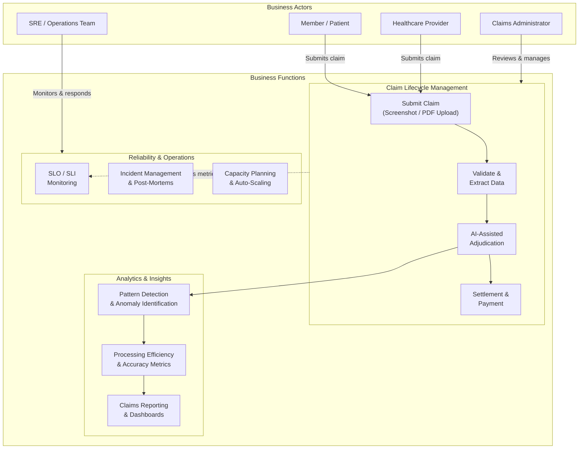

##### Claim Intake & Processing Workflow

> **Precondition:** Claims are always uploaded for an existing customer. The customer must already exist in the system before a claim can be submitted.

**Supported file formats:** PNG, JPG, TIFF (screenshots/images), PDF, DOCX, XLSX, CSV, and EDI (X12 837) claim files.

**Claim Processing Stages (Staff Dropdown):**

| Stage | Description |
|-------|-------------|
| `INTAKE_RECEIVED` | Claim artifact uploaded, pending initial review |
| `DOCUMENT_VERIFICATION` | Verifying document legibility, completeness, and format |
| `DATA_EXTRACTION` | AI extracts structured data from the uploaded artifact |
| `EXTRACTION_REVIEW` | Staff reviews and corrects AI-extracted data |
| `ELIGIBILITY_CHECK` | Verifying customer eligibility and policy coverage |
| `ADJUDICATION` | AI-assisted decision on claim approval, denial, or partial |
| `ADJUDICATION_REVIEW` | Staff reviews AI adjudication recommendation |
| `APPROVED` | Claim approved for payment |
| `DENIED` | Claim denied with reason codes |
| `PARTIAL_APPROVED` | Claim partially approved with adjustments |
| `SETTLEMENT` | Payment processing initiated |
| `CLOSED` | Claim fully settled and archived |
| `APPEAL` | Customer disputed denial, claim re-opened for review |

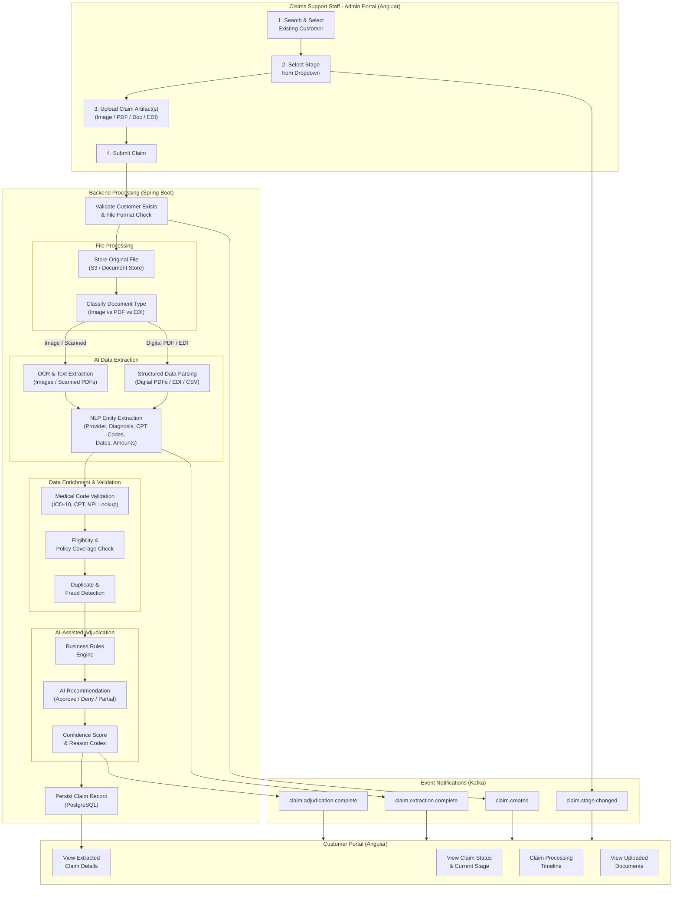

**Workflow summary:**
1. **Staff searches and selects an existing customer** in the Admin Portal
2. **Staff selects the claim stage** from the dropdown (typically starts at `INTAKE_RECEIVED`)
3. **Staff uploads one or more claim artifacts** — the system supports multiple files per claim (e.g., a scanned claim form image + an itemized bill PDF)
4. **Backend validates** customer existence and file formats, then stores originals in S3
5. **AI extracts structured data** — OCR for images/scanned PDFs, structured parsing for digital PDFs/EDI/CSV, then NLP extracts medical codes, provider info, diagnosis, dates, and amounts
6. **Data is enriched and validated** — medical code lookups (ICD-10, CPT, NPI), eligibility/policy checks, duplicate and fraud detection
7. **AI-assisted adjudication** — business rules + AI model produce a recommendation (approve/deny/partial) with confidence score and reason codes
8. **Staff reviews** extracted data and adjudication recommendation, corrects if needed, and advances the stage via the dropdown
9. **Customer sees results** in the Customer Portal — claim status, extracted details, processing timeline, and uploaded documents
10. **Kafka events** are emitted at each stage transition, enabling async downstream processing, audit trails, and real-time UI updates

##### 1. Core Application Architecture
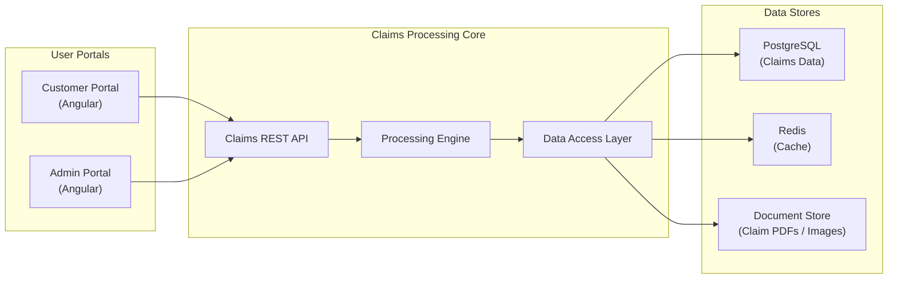

##### 2. Event-Driven Architecture
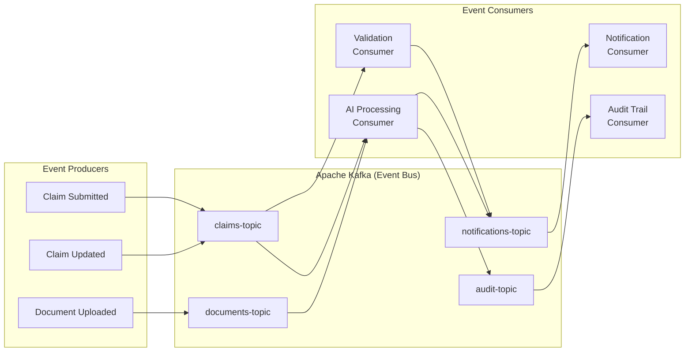

##### 3. Serverless Architecture
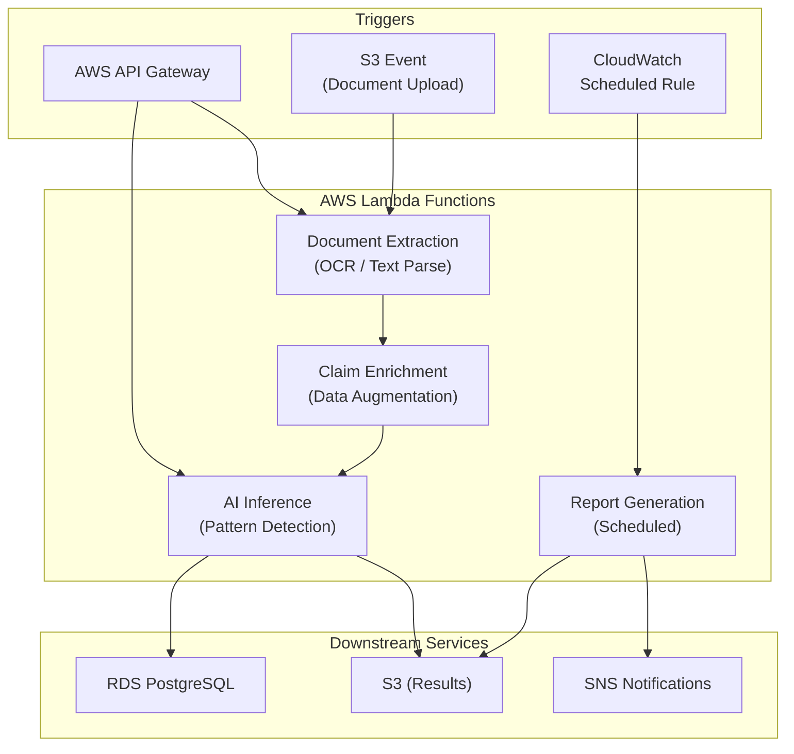

##### 4. AI Integration Architecture
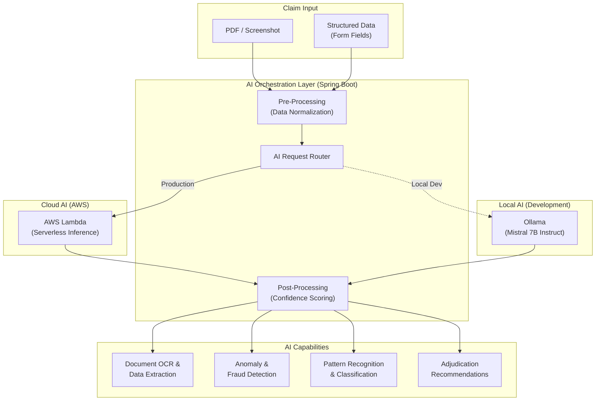

##### 5. AWS Cloud Deployment Architecture
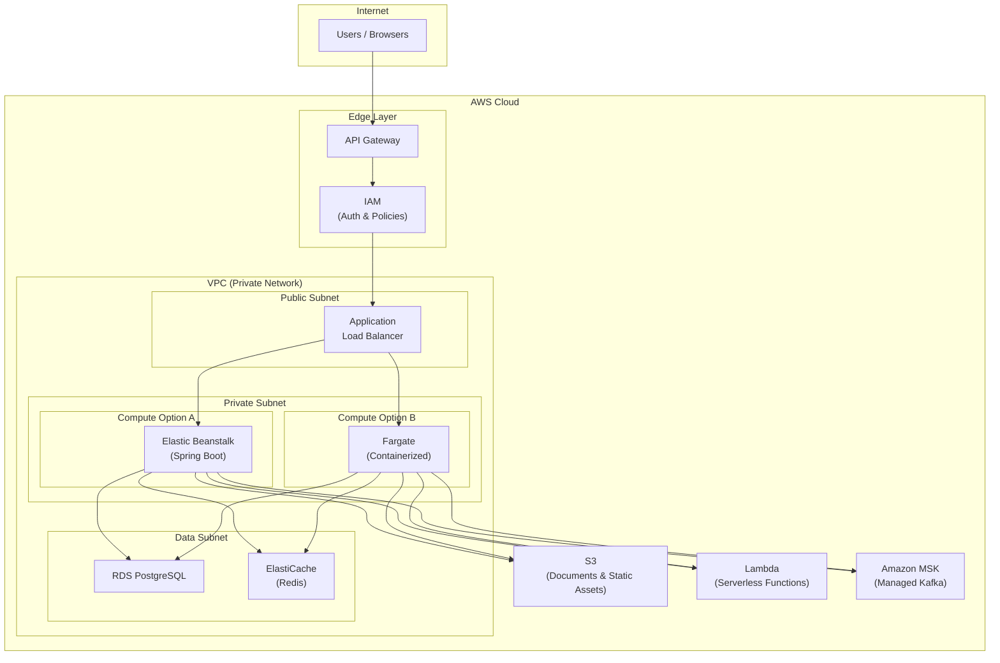

##### 6. SRE & Observability Architecture
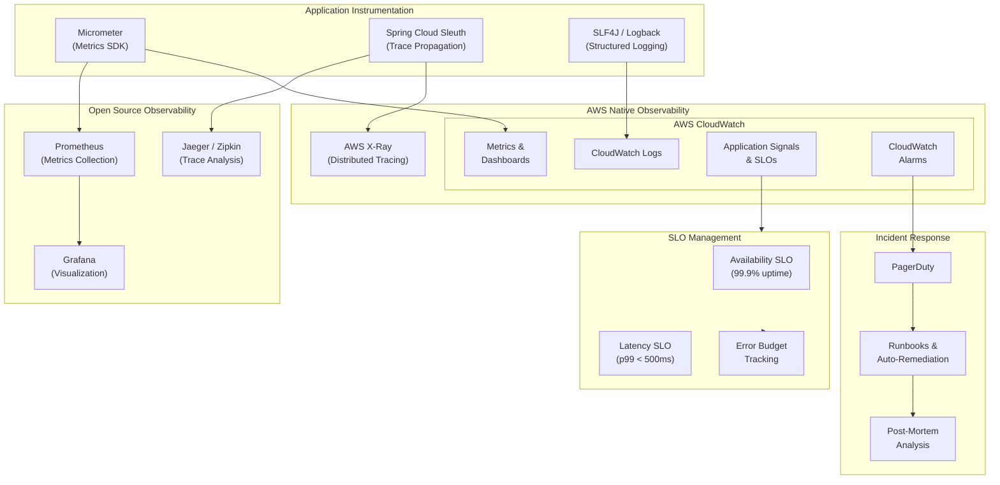

##### 7. DevOps CI/CD Architecture
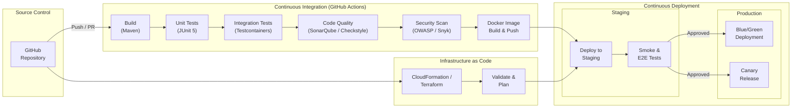

##### 8. Performance & Scalability Architecture
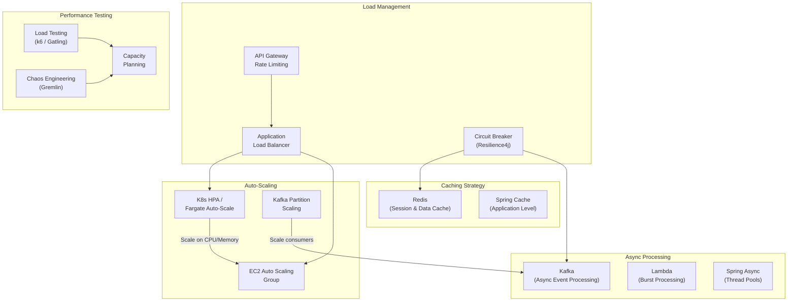

##### 9. Spring Boot & Spring Framework Stack
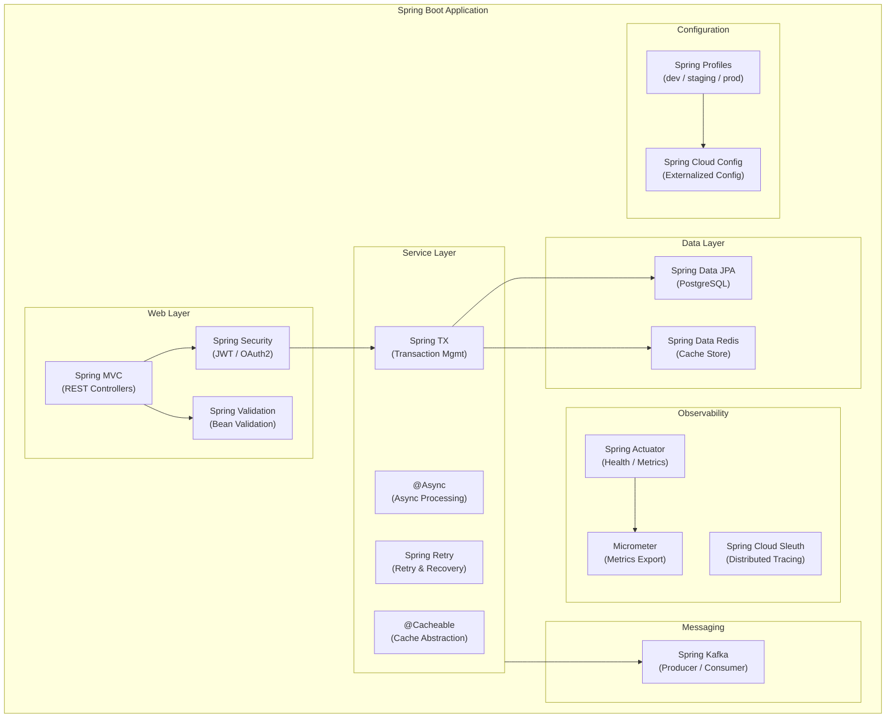

##### 10. Local Development Architecture
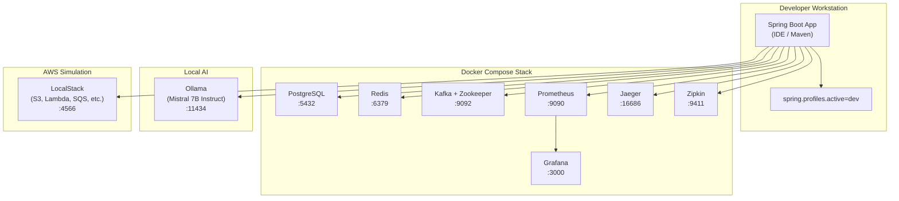

### Main objectives include:
#### Architecture and Design:
    - Showcase start to finish Architecture of Event Driven Architecture
#### AWS Cloud:
    - Leverage AWS Cloudwatch for monitoring and logging
    - Application Performance Monitoring (APM) with AWS X-Ray
    - Log aggregation and analysis with AWS CloudWatch Logs
    - Custom metrics and dashboards with AWS CloudWatch Metrics and Dashboards
    - SLOs and SLIs definition and monitoring with AWS CloudWatch SLOs
    - Implementing auto-scaling policies with AWS Auto Scaling
    - Disaster recovery planning and testing with AWS Backup and AWS Disaster Recovery
    - Deploy in AWS using AWS Elastic Beanstalk or AWS Fargate
    - Use GitHub Actions for CI/CD pipelines to automate testing and deployment
      - Create and Manage AWS resources using GitHub Actions
        - Use existing AWS VPC
        - Create AWS RDS instance for database needs
        - Create AWS S3 bucket for storage needs
        - Create AWS Lambda functions for serverless processing needs
        - Create AWS CloudWatch Alarms for monitoring needs
        - Create AWS IAM roles and policies for secure access management
        - Create AWS Elastic Beanstalk environment for application deployment
        - Create AWS Fargate tasks and services for containerized deployment
#### Azure Cloud:
     - Create and Manage Azure resources using GitHub Actions
    - Create and Manage GCP resources using GitHub Actions

### Claims Data integrates with AI models:
- Demonstrate integration of AI models for claims processing
- Implement SRE best practices for monitoring and reliability
  - Instrumentation with Prometheus and Grafana
  - Alerting with PagerDuty
  - Chaos engineering with Gremlin
  - Auto-scaling with Kubernetes Horizontal Pod Autoscaler (HPA)
  - Disaster recovery planning and testing
  - Incident management and post-mortem analysis
  - Service Level Objectives (SLOs) and Service Level Indicators (SLIs) definition and monitoring
  - Capacity planning and load testing
  - Blameless culture and continuous improvement practices
  - Documentation and knowledge sharing for SRE practices
  - Implementing a robust CI/CD pipeline for automated testing and deployment
  - Ensuring security best practices are followed in the development and deployment of the microservice, including vulnerability scanning and secure coding practices
  - 

## Repository Context

- **Parent project**: HealthCare-Plans-AI-Platform (multi-microservice architecture)
- **License**: Apache 2.0
- **Language expectation**: Java (based on .gitignore targeting .class, .jar, .war, .ear files)

## Build & Test Commands

No build system is configured yet. When one is added, update this section with:
- Build command (e.g., `mvn clean install` or `gradle build`)
- Run tests (e.g., `mvn test` or `gradle test`)
- Run single test (e.g., `mvn -pl module -Dtest=TestClass#method test`)
- Lint/format (e.g., `mvn checkstyle:check`)
- Run locally (e.g., `mvn spring-boot:run`)
