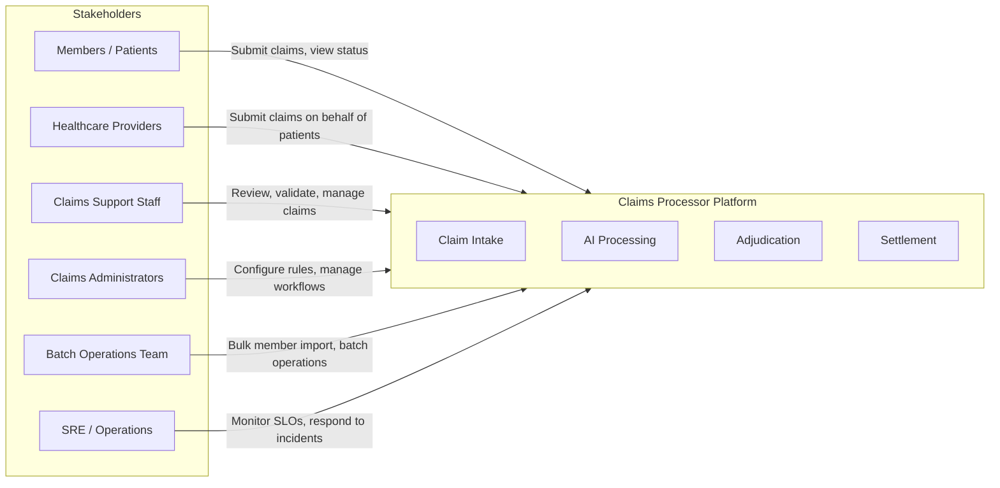
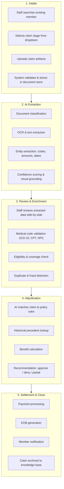
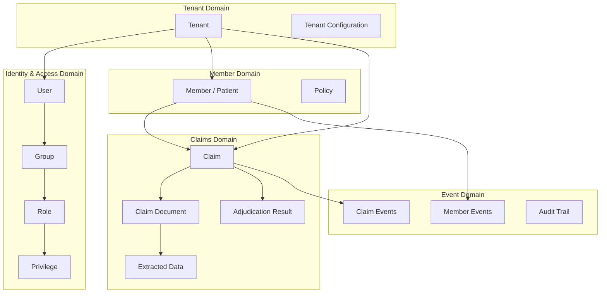
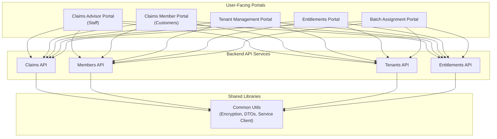
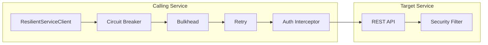
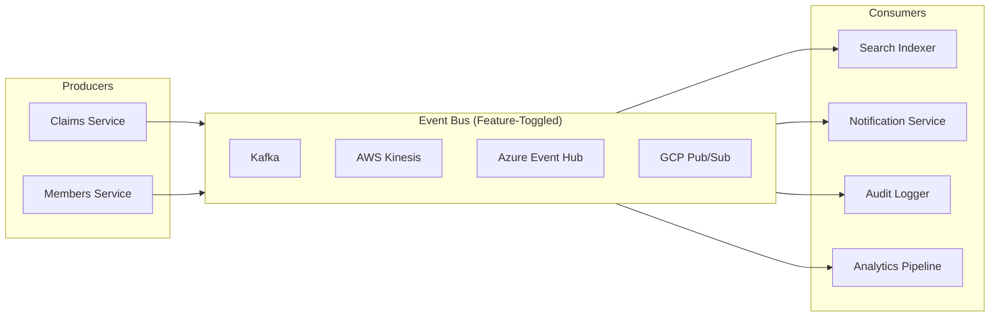
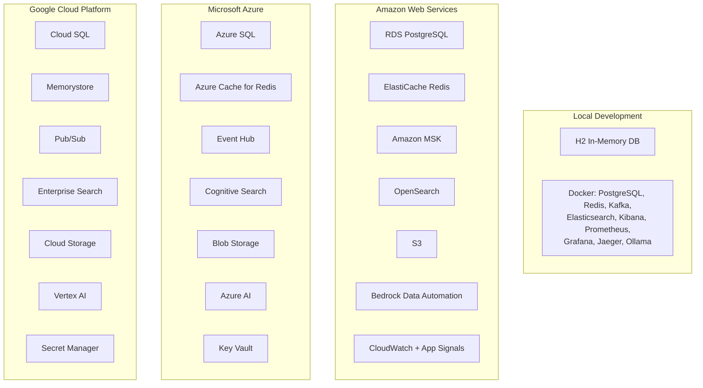

# Claims Processor With SRE

**HealthCare Plans AI Platform** — A multi-tenant healthcare claims processing platform with AI-powered automation and Site Reliability Engineering practices.

---

## Vision

Transform healthcare claims processing from a manual, error-prone workflow into an intelligent, automated pipeline that leverages AI for document understanding, pattern detection, and adjudication recommendations — while maintaining enterprise-grade reliability through SRE practices.

## Who Is This For?

- **Healthcare Payers** processing member claims
- **Third-Party Administrators (TPAs)** managing claims on behalf of payers
- **Claims Processing Organizations** seeking to modernize with AI and SRE
- **Platform Engineers** building multi-tenant healthcare SaaS

---

## 1. Business Architecture

### Business Context

Healthcare claims processing involves multiple stakeholders with distinct needs. Members and patients submit claims and track their status. Healthcare providers submit claims on behalf of patients. Claims support staff handle the day-to-day review, validation, and management of claims as they move through the processing pipeline. Claims administrators configure business rules, manage workflows, and oversee the adjudication process. Batch operations teams handle high-volume member imports and bulk processing tasks. Site Reliability Engineers monitor system health, track Service Level Objectives, and respond to incidents to keep the platform running reliably.

### Business Capabilities

**1. Multi-Tenant Claims Intake**

Organizations (tenants) onboard to the platform and configure their own claims workflows, business rules, and processing preferences. Each tenant operates in complete isolation from other tenants, ensuring data privacy and regulatory compliance. Claims support staff search for existing members within their tenant, upload claim artifacts in a wide range of formats, and select the appropriate processing stage for each claim. The platform accepts PNG, JPG, TIFF, PDF, DOCX, XLSX, CSV, and EDI X12 837 files, covering everything from scanned paper claims to electronic data interchange submissions.

**2. AI-Powered Document Understanding**

When a claim document is uploaded, the platform routes it through AI models for automatic data extraction. The system first classifies the document type — distinguishing between claim forms, Explanations of Benefits (EOBs), itemized bills, lab reports, prescriptions, and referrals. Once classified, the AI extracts structured data including patient demographics, provider details, diagnosis codes (ICD-10), procedure codes (CPT/HCPCS), service dates, and billed amounts. Every extracted field is accompanied by a confidence score, allowing staff to focus their review effort on low-confidence extractions rather than re-keying every field manually. This dramatically reduces manual data entry while maintaining accuracy through human oversight of uncertain extractions.

**3. Intelligent Adjudication**

AI models match each claim against the member's policy coverage rules, checking eligibility, benefit limits, pre-authorization requirements, and exclusions. The system also queries historical claim patterns to inform adjudication recommendations — identifying similar past claims and their outcomes. Claims that meet a configurable confidence threshold can auto-advance through adjudication, while low-confidence claims are queued for human review. When a claim requires human attention, the AI provides its reasoning and supporting evidence so that adjudicators can make informed decisions quickly rather than starting from scratch.

**4. Member and Entitlement Management**

The platform provides a complete multi-tenant identity and access management system. Users are organized into Groups, Groups are assigned Roles, and Roles contain fine-grained Privileges. Users can also receive individual Privileges beyond their Group assignments for exceptional cases. The system supports integration with external identity providers including Active Directory, Okta, and Auth0, allowing organizations to use their existing identity infrastructure. Tenant isolation is enforced at every layer, ensuring that users in one organization can never access data belonging to another.

**5. Operational Excellence (SRE)**

Reliability is not an afterthought — it is a first-class concern built into the platform from day one. Service Level Objectives define explicit reliability targets (such as 99.9% availability and p99 latency under 500 milliseconds). Error budgets track the margin between current reliability and the SLO target, informing decisions about whether to prioritize feature velocity or stability investments. The platform includes automated alerting on SLO breaches, security anomalies, infrastructure degradation, and application health issues. Observability is comprehensive: structured logs, distributed traces, and time-series metrics provide full visibility into system behavior.

### Claim Processing Lifecycle

The lifecycle of a claim follows a structured pipeline from initial intake through final settlement. Each stage is tracked, auditable, and visible to both staff and members.

During **Intake**, claims support staff locate the member in the system, select the appropriate processing stage, and upload one or more claim artifacts. The system validates file formats, scans for corruption, and stores the original documents in the document store with full versioning.

During **AI Extraction**, the platform classifies each document, performs OCR on image-based documents, and extracts structured entities such as diagnosis codes, procedure codes, provider identifiers, service dates, and billed amounts. Each extraction includes a confidence score and visual grounding (highlighting where on the document the data was found).

During **Review and Enrichment**, staff review the AI-extracted data in a side-by-side view with the original document. The system validates medical codes against standard code sets, checks member eligibility and coverage, and runs duplicate and fraud detection algorithms.

During **Adjudication**, the AI matches the enriched claim data against the member's policy rules and historical precedents. It calculates the benefit amount and provides a recommendation — approve, deny, or partial approval — along with its reasoning.

During **Settlement and Close**, approved claims proceed to payment processing. The system generates an Explanation of Benefits for the member, sends notifications, and archives the completed claim to the knowledge base for future reference and analytics.

### Claim Processing Stages

| Stage | Description |
|---|---|
| INTAKE_RECEIVED | Claim artifact uploaded, pending initial review |
| DOCUMENT_VERIFICATION | Verifying document legibility and completeness |
| DATA_EXTRACTION | AI extracting structured data from the artifact |
| EXTRACTION_REVIEW | Staff reviewing and correcting AI-extracted data |
| ELIGIBILITY_CHECK | Verifying member eligibility and policy coverage |
| ADJUDICATION | AI-assisted decision on claim |
| ADJUDICATION_REVIEW | Staff reviewing AI recommendation |
| APPROVED / DENIED / PARTIAL_APPROVED | Adjudication outcome |
| SETTLEMENT | Payment processing initiated |
| CLOSED | Claim fully settled and archived |
| APPEAL | Member disputed denial, claim re-opened |

---

## 2. Data Architecture

### Data Domains

The platform organizes its data into five distinct domains, each with clear ownership and boundaries. The Tenant Domain is the root of the data hierarchy — every other entity is scoped by tenant, ensuring complete multi-tenant isolation.

**Multi-Tenant Isolation** — Every data entity is scoped by a tenantId. The Tenant is the root entity from which all other data relationships descend. Database queries, API responses, and event streams are all filtered by tenant context, which is established at the authentication layer and propagated through every service call. This ensures that a user in one tenant can never accidentally or intentionally access another tenant's data.

**Identity Model** — Users belong to Groups, Groups are assigned Roles, and Roles contain Privileges. This hierarchical model supports both broad organizational policies (via Groups and Roles) and fine-grained exceptions (via individual Privilege assignments). The identity model integrates with external providers, allowing organizations to federate authentication while the platform manages authorization.

**Claims Data Flow** — A Claim references a Member and contains one or more Claim Documents (the uploaded artifacts). Each Document produces Extracted Data (the AI-parsed structured information) and ultimately an Adjudication Result. This chain of data relationships preserves full traceability from the original document through to the final decision.

**Event Sourcing** — All state transitions across the platform emit events to the event bus. These events drive asynchronous processing (such as search index updates and notifications), create immutable audit trails for compliance, and feed analytics pipelines for operational intelligence. The event-driven approach decouples producers from consumers, allowing new downstream capabilities to be added without modifying existing services.

**Data Security** — All external-facing identifiers (tenant IDs, member IDs, claim IDs, user IDs) are encrypted using AES-256-GCM before leaving the system boundary. This means that IDs visible in API responses, URLs, and logs are encrypted tokens rather than raw database identifiers, preventing enumeration attacks and reducing the impact of data exposure.

### Data Storage Strategy

The platform uses purpose-built storage for each data category, selecting the right tool for each job rather than forcing all data into a single store.

| Data Type | Storage | Purpose |
|---|---|---|
| Transactional Data | PostgreSQL (RDS / Cloud SQL / Azure SQL) | Claims, members, tenants, entitlements — the system of record |
| Document Storage | S3 / Azure Blob / GCS | Original claim artifacts (PDFs, images, EDI files) with versioning |
| Cache | Redis / ElastiCache / Azure Redis | Session data, frequently accessed lookups, rate limiting counters |
| Search Index | Elasticsearch / OpenSearch / Azure Cognitive Search | Full-text search across claims and member records |
| Event Stream | Kafka / Kinesis / Event Hub / Pub/Sub | Real-time event processing, async workflows, audit trails |
| Application Logs | Elasticsearch via Filebeat | Structured JSON log aggregation and analysis |
| Metrics | Prometheus / CloudWatch / Azure Monitor | Time-series performance and reliability data |
| Traces | Jaeger / Zipkin via OpenTelemetry | Distributed request tracing across service boundaries |

---

## 3. Application Architecture

### Service Landscape

The platform is organized into user-facing portals, backend API services, and shared libraries. Each portal and API service is independently deployable, allowing teams to develop, test, and release services on their own schedules.

**Portals** deliver rich user interfaces for different stakeholder personas. The Claims Advisor Portal is designed for claims support staff, providing document upload, side-by-side review, and claim management workflows. The Claims Member Portal gives members and patients visibility into their claim status and history. The Tenant Management Portal allows administrators to onboard and configure tenants. The Entitlements Portal manages users, groups, roles, and privileges. The Batch Assignment Portal supports high-volume operations such as bulk member imports from spreadsheets.

**API Services** are pure backend services exposing REST APIs. They implement CQRS (Command/Query Responsibility Segregation), maintaining separate controllers, service layers, and in some cases repository layers for read operations versus write operations. This separation allows read and write workloads to be optimized and scaled independently.

**Common Utils** is a shared library consumed by all services. It provides standardized ID encryption (ensuring all external-facing IDs are encrypted), common data transfer objects (such as ApiResponse and PagedResponse for consistent API responses), and a resilient inter-service HTTP client with built-in circuit breaker, bulkhead, and retry capabilities.

### Inter-Service Communication

All service-to-service communication flows through a resilient client that protects the platform from cascade failures and transient errors.

Every inter-service call goes through the ResilientServiceClient, which layers multiple resilience patterns. The **Circuit Breaker** monitors the failure rate of calls to each target service and opens the circuit (fast-failing all requests) when the failure rate exceeds 50%, preventing a struggling downstream service from dragging down its callers. The **Bulkhead** limits the number of concurrent calls to each target service (25 maximum), preventing any single downstream dependency from exhausting the caller's thread pool. The **Retry** mechanism handles transient failures by automatically retrying failed requests up to 3 times with exponential backoff. The **Auth Interceptor** attaches authentication credentials to outbound requests. Authentication mode is feature-toggled and supports multiple providers: no authentication (for local development), basic authentication, JWT tokens, AWS Cognito, Azure Active Directory, and GCP IAM.

### Event-Driven Architecture

The platform uses an event-driven architecture to decouple services and enable asynchronous processing. The event bus implementation is feature-toggled, allowing the platform to run with different event streaming technologies depending on the deployment environment.

When a claim changes state or a member record is updated, the producing service emits an event to the event bus. Downstream consumers process these events independently: the Search Indexer updates the full-text search index, the Notification Service sends alerts to members and staff, the Audit Logger creates immutable audit records for compliance, and the Analytics Pipeline feeds operational dashboards and business intelligence. Because consumers are decoupled from producers, new consumers can be added without modifying existing services.

---

## 4. Technology Architecture

### Multi-Cloud Strategy

The platform is designed to run on any major cloud provider or locally on a developer workstation. Cloud-specific integrations (databases, object storage, event streaming, AI services, secrets management, and observability) are abstracted behind feature toggles and Spring profiles, allowing the same application code to deploy across environments without modification.

For **local development**, services start with an embedded H2 in-memory database by default, requiring zero infrastructure setup. When a more production-like environment is needed, a Docker Compose stack provides PostgreSQL, Redis, Kafka, Elasticsearch, Kibana, Prometheus, Grafana, Jaeger, and Ollama (for local AI inference using Mistral 7B).

On **AWS**, the platform uses RDS PostgreSQL for transactional data, ElastiCache for caching, Amazon MSK for event streaming, OpenSearch for full-text search, S3 for document storage, Bedrock Data Automation for AI-powered document processing, and CloudWatch with Application Signals for observability.

On **Azure**, the equivalent services are Azure SQL, Azure Cache for Redis, Event Hub, Cognitive Search, Blob Storage, Azure AI, and Key Vault for secrets management.

On **GCP**, the platform uses Cloud SQL, Memorystore, Pub/Sub, Enterprise Search, Cloud Storage, Vertex AI, and Secret Manager.

### Observability Architecture

The SRE observability stack provides three pillars of visibility into the platform's behavior: metrics, logs, and traces.

**Metrics** flow from application instrumentation (via Micrometer) to Prometheus for collection and storage, and then to Grafana for visualization. The platform ships with five pre-built Grafana dashboards: an SLO Overview dashboard tracking availability and latency objectives with error budget burn rates; an Application Health dashboard showing JVM metrics, thread pools, garbage collection, and uptime; a Claims Processing dashboard monitoring claim throughput, stage durations, and AI extraction latency; an Infrastructure dashboard tracking PostgreSQL, Redis, and Kafka health; and an Auth and Resilience dashboard monitoring authentication success rates and circuit breaker states.

**Logging** uses structured JSON output (via Logback) collected by Filebeat and shipped to Elasticsearch. Kibana provides three pre-configured data views: Application Logs for operational troubleshooting, Claims Data for claims-specific analysis, and Members Data for member-related investigations. Structured logging ensures that every log entry includes correlation IDs, tenant context, and request metadata for precise filtering and analysis.

**Tracing** uses the OpenTelemetry standard, with trace data flowing to both Jaeger and Zipkin. Distributed traces follow requests as they cross service boundaries, making it straightforward to identify latency bottlenecks, understand call chains, and diagnose failures in the distributed system. All nine services participate in trace propagation.

**Alerting** is comprehensive, with 28 Prometheus alert rules and 14 Grafana alert rules covering service availability, error rates, SLO breaches, error budget exhaustion, high latency (p99), Kafka consumer lag, Redis connection failures, JVM memory pressure, and disk usage. Alerts route through Alertmanager to PagerDuty, Slack, and email channels based on severity.

### Reliability and Resilience

The platform implements multiple resilience patterns to ensure reliable operation under adverse conditions.

| Pattern | Implementation | Purpose |
|---|---|---|
| Circuit Breaker | Resilience4j | Prevent cascade failures when downstream services degrade |
| Bulkhead | Resilience4j | Isolate concurrent call limits per dependency to prevent resource exhaustion |
| Rate Limiter | Resilience4j | Protect services against unexpected traffic spikes |
| Retry | Resilience4j | Automatically recover from transient failures with exponential backoff |
| Connection Pool | HikariCP | Efficient, bounded database connection management |
| SLOs / SLIs | CloudWatch App Signals + Prometheus | Define and continuously track reliability targets |
| Error Budgets | Prometheus recording rules | Balance reliability investment against feature development velocity |
| Feature Toggles | Spring ConfigurationProperties | Safe, incremental rollout of new integrations and capabilities |

---

## Getting Started

For setup instructions, see:
- **[First Time Setup](Docs/MD_Files/README_Developer_First_Time.md)** — prerequisites, build, and initial run
- **[Daily Development](Docs/MD_Files/README_Developer_Daily_Activities.md)** — common commands, debugging, testing
- **[Deployment Guide](Docs/MD_Files/README_Developer_Deployment_Technical.md)** — profiles, Docker, cloud deployment

For architecture details with detailed Mermaid diagrams, see **[CLAUDE.md](CLAUDE.md)**.

For all service links, Swagger UIs, dashboards, and credentials, open **[index.html](index.html)** in your browser.

---

## License

This project is licensed under the [Apache License 2.0](LICENSE).
